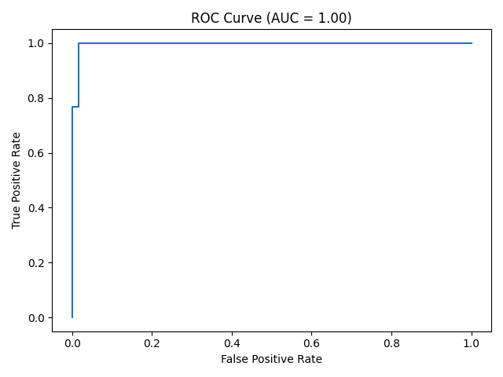
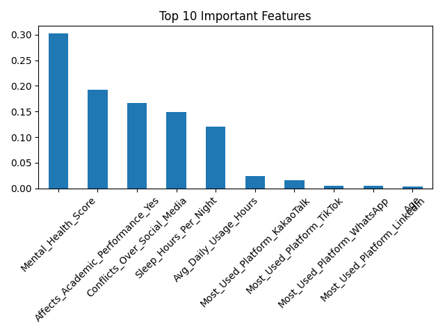

# 📱 Social Media Addiction Risk Prediction

[](https://social-media-addiction-ml.streamlit.app)

## 🚀 Project Overview

This project builds a Machine Learning classification model to predict **high social media addiction risk** among students using behavioral and lifestyle indicators.

The goal is to identify high-risk individuals based on academic impact, sleep patterns, mental health score, usage behavior, and relationship factors.

### 🎯 Run Locally

To run the interactive Streamlit app locally, use:

```bash
streamlit run app.py
```

The app will launch at `http://localhost:8501` and allow you to assess your addiction risk!

---

## 📸 App Screenshots

### Risk Assessment Interface


_Main interface with user input sliders and dropdowns, plus sidebar with model information._

### Model Performance & Insights


_Feature importance chart and confusion matrix displayed side-by-side for model transparency._

---

## 📊 Dataset

- 705 student survey responses
- 13 original features
- Mix of numerical and categorical variables
- Target engineered as binary:
  - `1` → High Addiction
  - `0` → Low Addiction

## 🧠 Problem Statement

Can we predict high addiction risk using behavioral indicators rather than just usage hours?

This model aims to support early detection and behavioral intervention strategies.

## ⚙️ Data Preprocessing

- Removed identifier column (`Student_ID`)
- Engineered binary target from `Addicted_Score`
- Dropped raw score column to prevent data leakage
- One-hot encoded categorical variables
- Applied stratified 80/20 train-test split
- Controlled overfitting using tree depth restriction

## 🤖 Models Compared

| Model                      | Test Accuracy |
| -------------------------- | ------------- |
| Logistic Regression        | ~96%          |
| Random Forest (Controlled) | ~96–99%       |
| Gradient Boosting          | ~97%          |

Final Model Selected: **Random Forest**

Reason:

- Stable performance
- Handles nonlinear relationships well
- Minimal preprocessing requirements
- Provides feature importance insights

## 📈 Model Performance

- **Train Accuracy:** ~98–100%
- **Test Accuracy:** ~96–99%
- **5-Fold Cross Validation Mean:** ~97%
- **ROC AUC:** ~1.00

### Confusion Matrix

|             | Predicted Low | Predicted High |
| ----------- | ------------- | -------------- |
| Actual Low  | 58            | 1              |
| Actual High | 0             | 82             |

The model demonstrates strong generalization and stable performance across validation folds.

## 🔍 Feature Importance Insights

Top Predictive Features:

1. Academic Performance Impact
2. Social Media Conflicts
3. Mental Health Score
4. Sleep Hours per Night
5. Average Daily Usage Hours

### Key Insight

Behavioral consequences (academic impact and conflicts) are stronger predictors of addiction risk than raw usage time alone.

## 📷 Visualizations

### ROC Curve



### Top 10 Feature Importance



## 📂 Project Structure

social-media-addiction-ml/
│
├── data/
│ └── raw/
│ └── Students Social Media Addiction.csv
│
├── notebooks/
│ └── 01-data-understanding.ipynb
│
├── src/
│ └── train.py
│
├── requirements.txt
├── README.md
└── .gitignore

## ⚠️ Limitations

- Dataset is survey-based and may contain response bias
- Relatively small dataset size (705 records)
- Some predictors may be strongly correlated with how the addiction score was constructed

---

## 🚀 Future Improvements

- Perform hyperparameter tuning using GridSearchCV
- Add SHAP-based model interpretability
- Deploy the model using Streamlit
- Validate on a larger and more diverse dataset

## 💡 Conclusion

This project demonstrates how behavioral indicators can effectively predict high social media addiction risk among students.

The Random Forest model achieved strong generalization performance and revealed that academic impact and social conflicts are stronger predictors than raw usage time alone.

The project follows proper machine learning practices including data cleaning, leakage prevention, stratified validation, model comparison, and overfitting control.

## 📚 Sources

- Dataset: [Social Media Addiction Dataset](https://www.kaggle.com/datasets/...)

- Scikit-learn Documentation: https://scikit-learn.org/
- Matplotlib Documentation: https://matplotlib.org/
- Pandas Documentation: https://pandas.pydata.org/
